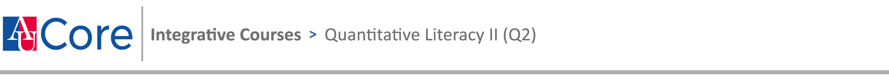

# American University COMM-260, Fall 2025
## Quantitative Methods for Journalists

**Instructor**: Sean McMinn

**Contact**: smcminn@american.edu. On weekdays, I will try to respond to all messages within 24 hours. If you do not hear from me within that time frame, feel free to send a follow-up message.

**Class time**: Th 11:20 a.m. - 2:10 p.m.

**Office hours**: After class or by appointment

**Description**: Reporters find news every day by talking to people and unearthing their stories. In this class, we're going to do the same — but with data. This is not a graphic design or programming class, but a course that will teach you how to use the huge number of datasets available to reporters in order to break news and help inform your audience through text and visuals. By the end of this course, you should be able to:

* Find datasets relevant to a story you're reporting
* Process and clean data
* Analyze and "interview" data to find a story within it
* Visualize and present a story based on data
* Speak the language of reporters and technologists who use data to tell stories
* Identify common problems with data and think critically about its use in news reporting

Special thank you to [Rachel Shorey](https://github.com/rshorey/digitalframeworks-spring18) of The New York Times for contributions to the class materials and its syllabus.

### Quantitative Literacy II (Q2) Learning Outcomes

* Translate real-world questions or intellectual inquiries into quantitative frameworks.
* Select and apply appropriate quantitative methods or reasoning.
* Draw appropriate insights from the application of a quantitative framework.
* Explain quantitative reasoning and insights using appropriate forms of representation so that others could replicate the findings.

### Expectations

* Come to class or let me know if you can't make it. I understand that situations occur that make it difficult to attend, and I'm willing to help you if you get in touch with me. Either way, you will be responsible for the material unless otherwise agreed upon.
* You will receive two excused absences. **A third absence for any non-approved reason will result in you losing one-half of your attendance points (10% pts. off your grade).** 
* Complete assignments either in class or as homework due before the next class. 
   * Late assignments will only be accepted if you contact me and we reach an agreement **before** the class in which it was originally due. 
* Submit assignments on Github (instructions in first lecture) as specified in the assignment.
* Consume the news every week, and come to class ready to share at least one story that uses data in a substantial way. I will randomly select two students to share a story at the beginning of class, so please have a link ready to go (and I will do the same). This will count toward your participation/attendance grade.
* Subscribe (for free) and read The Department of Data in The Washington Post. Come to class prepared to discuss. I will call on people to talk about it and this will count toward your participation/attendance grade.
* Complete a final project
* I reserve the right to change this syllabus at any time, provided all changes are pushed to GitHub where you can track them in the "commits" section for this repository. If at any time you feel like a change I made isn't fair, you can tell me why and I'll reconsider it.
* Please make sure you have the following software:  
	* Microsoft Excel 
	* [Tabula](https://tabula.technology/) (free)
	* [Sublime text editor](https://www.sublimetext.com/download) (free)
	* [QGIS](https://qgis.org/download/) (free)
	* [JupyterLab Desktop](https://github.com/jupyterlab/jupyterlab-desktop) (free)
	* We might dabble in some other free software as well, which we can download together. 
* I will use Canvas messaging as the primary means of communicating with the class, making your use a required element. Please make sure you check your email daily.
* All lectures/assignments/class materials will be available on Github.

### Grading

Your grade will be made up of three components:

* 20%: Class attendance and participation, including presenting data stories when I call on you to do so
* 50%: Assignments
* 30%: Final project

##### Assignment grading scale

* A: publishable with minimal edits (spelling, grammar and AP style count)
* B: publishable with significant edits
	* You cannot get more than a B on an assignment if there are any factual errors.
* C: would need reporter’s revision to be published
	* You cannot get more than a C on an assignment if there are significant factual errors.
* D: unpublishable, even with edits 
* F: did not complete work as assigned

**Note**: I will attempt to have all assignments graded within one week of you turning them in, and I will send you your assignment grades ASAP via Canvas. You can ask questions/for feedback about assignments or grades at any time. If you'd like to see your overall course grade, please talk to me during class and I'll show you a detailed breakdown.

*To make sure you are on track for the course, I will send an AU academic alert to your adviser if you earn a C or lower on two assignments. There is no punitive consequence for this.*

### Collaboration with humans (and AI)

Students are encouraged to discuss assignments and occasionally work in groups as assigned. Your final work, however, must be entirely your own or your group's. A good rule of thumb is that no one else should take over your keyboard while completing an assignment. All American University policies regarding cheating apply to this class.

We can and will use online tools — including AI — to help you solve technical issues, brainstorm ideas, etc. **You should NOT use AI to generate any text/graphics that you then claim as your own. This is a fireable offense in a newsroom and will be handled in coordination with the Office of Academic Integrity.** If there is a reason to include AI-generated text (e.g. you are auto-generating part of a data pipeline), please label it as such. 

### A typical class

* Share data stories
* Lecture
* Interactive lesson
* Introduce assignment
* Time for assignment work or questions

### Schedule

This is subject to revisions based on availablity, final project pacing, etc.

**Class 1: Start here!/Story assignment**

* [Assessment quiz](https://docs.google.com/forms/d/e/1FAIpQLSffx9wWR8lH7PrLpM0WPCqq0kTN8US1xuoQLeCCvNPkxrz0yw/viewform)
* [Submit your github repo](https://docs.google.com/forms/d/e/1FAIpQLScIAfWHr8d6qS3heYwbPkHwZcyKzVT-ztaowKgXuS4Ty9UjUA/viewform)
* [Assignment 1](assignments/assignment1.md) 

**Class 2: Finding data**

**Class 3: Cleaning/analyzing data pt I**

**Class 4: Cleaning/analyzing data pt II**

**Class 5: Stats for journalists**

**Class 6: Data viz pt I**

**Class 7: Data viz pt II**

**Class 8: Mapping, geographic data**

**Class 9: Covering federal govt with data**

**Class 10: Writing about data (asynchronous class)**

**Class 11: Automating all this pt I**

**Class 12: Automating all this pt II**

**Class 13: What the hell is an API? / Deconstructing stories**

Class 14: No class (Thanksgiving)

**Class 15: AI in the newsroom**

### [Final project](finalproject.md)

Details will be posted above link. Due Thu, Dec 11, 2025 5 p.m.

### Students with disabilities

If you wish to receive accommodations for a disability, please notify me with a memo from the Academic Support and Access Center. As accommodations are not retroactive, timely notification at the beginning of the semester, if possible, is strongly recommended. To register with a disability or for questions about disability accommodations, contact the Academic Support and Access Center at 202-885-3360 or asac@american.edu. For more information, visit AU’s [Disability Accommodations web page](https://www.american.edu/provost/academic-access/documentation-and-eligibility.cfm).

